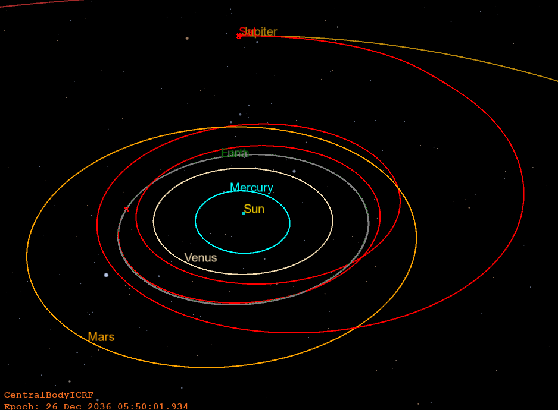

# GMAT_LowThrust
 
  GMAT_LowThrust.m is a MATLAB function that writes GMAT script files to propagate and optimize
   low-thrust trajectory problems.
   Low_Thrust problems may be propagated as is or optimized.
   The bin folder of GMAT must be within your path variable for the API commands used in this function to work.
   Optimization is done using SNOPT 7.6 Matlab interface (Other versions
   may work).
   SNOPT is an advanced nonlinear optimization tool.
   SNOPT Guide Link: 
   https://ccom.ucsd.edu/~optimizers/docs/snopt/interfaces.html#matlab
   https://ccom.ucsd.edu/~optimizers/static/pdfs/sndoc7.pdf
   It's license is proprietary and must be aquired from: https://ccom.ucsd.edu/~optimizers/
   SNOPT is not required to generate low-thrust GMAT propagation scripts, but is required to optimize your trajectory. 
   SNOPT Matlab folder must also be within the path variable for optimization to work. 
   The constraint / objective function is called using objFunc_conFunc.
   GMAT_LowThrust.m uses MATLAB's table2array and readtable functions which seem to only work properly with MATLAB 2020a or newer.
   To use older versions of MATLAB you will need to replace the method used to read in selected information from the Excel data table. 
   
   #### Earth to Jupiter and Earth to Mars Low-Thrust Trajectories created with this function
   <p float="center">
    
   </p>
    <p align="center">
   
   </p>
   
  ### Optimization Notes and Limitations

   1) Optimization assumes that thrust/acceleration magnitude remains
   constant, and if fuel mass is decremented, it's constant for all time steps.
   2) Optimization works by updating a GMAT thrust history file and rerunning a
   GMAT script. This process is computationally inefficient as files must be
   saved to the hard drive. -> Long run times
   3) Optimization performance depends on how the design variable, constraint,
   and objective bounds are defined. You may want to adjust these parameters
   to improve the performance of your problem. 
   4) Problems with more than 200 steps tend to take more than 10 hours to
   optimize for optimal time of flight. 
   5) Running with a smaller number of steps first and interpolating solution 
   as inital guess apears to decrease overall run time

   ### Function inputs and outputs
   ```
   [OutPut_DataStruct]=GMAT_LowThrust(FileName,varargin)
   ```
   1) OutPut_DataStruct includes the time step array, ICRF coordinates thrust
   array, Alpha (in-plane), and Beta (out-plane) thrust angles. X is the design
   variable array from the last optimization iteration. 
   2) FileName is the name of the Excel file that includes the set-up
   information about your problem. Example input: "\EarthToMarsProblem.xlsx"
   3) varargin includes the optional inputs
  
       i) 'Optimize' option tells the function that you want to optimize your
       low-thrust problem. This will launch the SNOPT optimization
       sequence and run 'objFunc_conFunc' (objective/constraint function)
       
       ii) By default, the optimizer will run with default settings. To
       change settings, you need to pass in a struct after 'Optimize' that
       includes your optimization settings. Example:
       
         ```
      opt = struct( ...
         'TOF_LowBound',200,'TOF_UpperBound',1000,'MajorFeasibilityTolerance',1e-6,...
         'MajorOptimalityTolerance',1e-6,'OptimizationRunTimeLimit',86400,...
         'MajorIterationLimit',5000,'Obj','Cons')
         ```
       a) TOF_LowBound and TOF_UpperBound, are the lower and upper bound
       time of flight used in the optimization sequence. Values in days
       
       b) MajorFeasibilityTolerance and MajorOptimalityTolerance are the feasibility 
       and optimality tolerance SNOPT settings 
       
       c) OptimizationRunTimeLimit is how long the SNOPT optimization
       sequence will run. In seconds
       
       d) MajorIterationLimit is the limit on the number of major
       iterations that will be run during optimization
       
       e) Obj is the objective function setting option. The two settings are
       'Cons' and 'TOF'
       
         'Cons' is used to minimize the state vector constraints without
           defining the Time of Flight as the objective to minimize
           
         'TOF' is used to optimize the Time of Flight as the
           objective function
           
   4) The function will also generate the files GMAT_RunScript_Plots.script and 
   GMAT_ThrustProfileSolution.thrust in the GMAT_RunFolder. GMAT_RunScript_Plots is a GMAT file
   that can be used to plot the orbital trajectory (for visualization) and 
   GMAT_ThrustProfileSolution is the thrust history file used to propagate
   the trajectory. During optimization, the files GMAT_RunScript and
   GMAT_RunThrustProfile will also be created. GMAT_RunThrustProfile will 
   have the most up-to-date iteration in the optimization sequence.
   If you need to end the optimization sequence before GMAT_RunScript_Plots 
   and GMAT_ThrustProfileSolution.thrust are generated, you can modify the
   existing GMAT_RunScript_Plots to run the last iteration of GMAT_RunThrustProfile.
   5) The file SNOPT_summary.txt will also be created during the
   optimization sequence. This file includes a summary of the SNOPT optimization.

   ### Example Input

   Propgating trajectory without optimization:
   ```
   OutPut_DataStruct=GMAT_LowThrust("\EarthToMarsProblem.xlsx")
   ```
   Optimizing using default settings:
   ```
   OutPut_DataStruct=GMAT_LowThrust("\EarthToMarsProblem.xlsx",'Optimize')
   ```
   Optimizing using own settings struct:
   ```
   OutPut_DataStruct=GMAT_LowThrust("\EarthToMarsProblem.xlsx",'Optimize',Opt)
   ```
   Supporting Functions:

   X_interpreter-> can be used to generate output struct if optimization
   sequence is paused/terminated before completion. 
   GMAT_LowThrustDataInterolator-> can be used to increase or decrease the
   number of time steps of a problem.
   LowThrustOutputStructToExcel-> can be used to regenerate the Excel set-up
   sheet using output struct. 

   Known Errors:   
   1) 'Minor iteration limit' is stuck at 10000
   2) MATLAB's functions for reading the Excel table does not work for MATLAB 2019 or older
   
   Protental Improvments:
   1) Replacing/Providing the option to optimize with GMAT's CSALT plugin
   2) Improve run time of optimization
